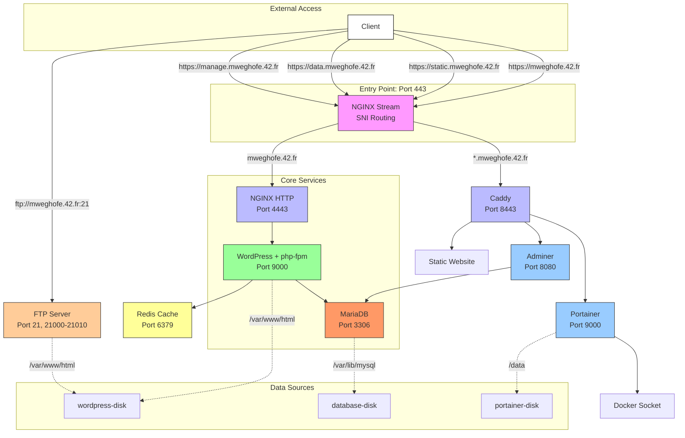

```mermaid
%% Inception Architecture - Simplified
flowchart TD
    subgraph External Access
        direction TB
        E1[Client]
    end

    subgraph "Entry Point: Port 443"
        NG[NGINX Stream\nSNI Routing]
    end
    
    %% Bonus Services
    CD[Caddy\nPort 8443]
    AD[Adminer\nPort 8080]
    SW[Static Website]
    RD[Redis Cache\nPort 6379]
    PT[Portainer\nPort 9000]
    FTP[FTP Server\nPort 21, 21000-21010]

    %% Service interactions
    CD --> SW
    CD --> AD
    AD --> DB
    WP --> RD
    PT --> DS
    CD --> PT

    subgraph Core Services
        NH[NGINX HTTP\nPort 4443] --> WP[WordPress + php-fpm\nPort 9000]
        WP --> DB[MariaDB\nPort 3306]
    end

    subgraph Data Sources
        WV[wordpress-disk]
        DV[database-disk]
        PV[portainer-disk]
    end

    DS[Docker Socket]

    %% External URLs
    E1 -->|https://mweghofe.42.fr| NG
    E1 -->|https://static.mweghofe.42.fr| NG
    E1 -->|https://data.mweghofe.42.fr| NG
    E1 -->|https://manage.mweghofe.42.fr| NG
    E1 -->|ftp://mweghofe.42.fr:21| FTP

    %% NGINX Routing
    NG -->|mweghofe.42.fr| NH
    NG -->|*.mweghofe.42.fr| CD


    %% Volume mounts
    WP -.->|/var/www/html| WV
    DB -.->|/var/lib/mysql| DV
    PT -.->|/data| PV
    FTP -.->|/var/www/html| WV

    %% Style
    style NG fill:#f9f,stroke:#333
    style NH fill:#bbf,stroke:#333
    style CD fill:#bbf,stroke:#333
    style WP fill:#9f9,stroke:#333
    style DB fill:#f96,stroke:#333
    style FTP fill:#fc9,stroke:#333
    style RD fill:#ff9,stroke:#333
    style AD fill:#9cf,stroke:#333
    style PT fill:#9cf,stroke:#333
    classDef external fill:#fff,stroke:#000
    class E1 external
```
