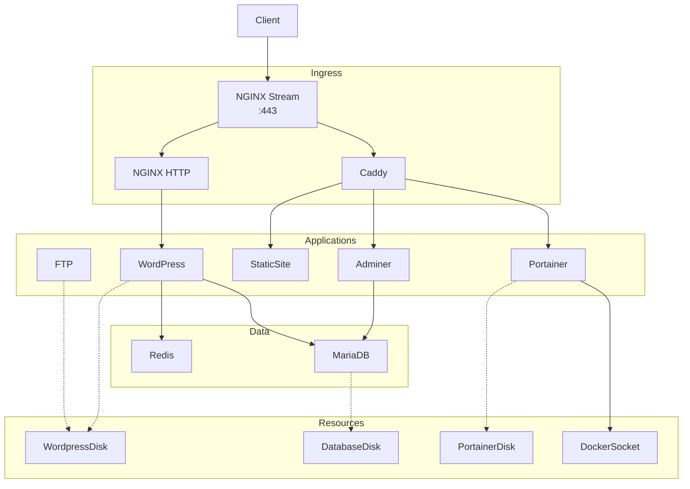

```mermaid
flowchart TB

    Client

    subgraph Ingress
        Stream["NGINX Stream\n:443"]
        Http["NGINX HTTP"]
        Caddy
    end

    subgraph Applications
        WordPress
        Adminer
        StaticSite
        Portainer
        FTP
    end

    subgraph Data
        Redis
        MariaDB
    end

    subgraph Resources
        WordpressDisk
        DatabaseDisk
        PortainerDisk
        DockerSocket
    end

    Client --> Stream

    Stream --> Http
    Stream --> Caddy

    Http --> WordPress

    Caddy --> Adminer
    Caddy --> StaticSite
    Caddy --> Portainer

    WordPress --> Redis
    WordPress --> MariaDB
    Adminer --> MariaDB


    Portainer --> DockerSocket

    FTP -.-> WordpressDisk
    WordPress -.-> WordpressDisk

    MariaDB -.-> DatabaseDisk
    Portainer -.-> PortainerDisk
```
