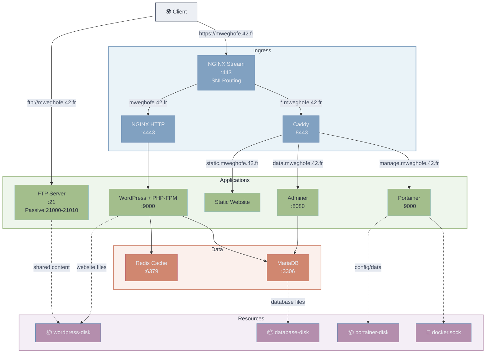

```mermaid
flowchart TB

    Client["🌍 Client"]

    subgraph Ingress
        Stream["NGINX Stream<br/>:443<br/>SNI Routing"]
        Http["NGINX HTTP<br/>:4443"]
        Caddy["Caddy<br/>:8443"]
    end

    subgraph Applications
        WordPress["WordPress + PHP-FPM<br/>:9000"]
        Adminer["Adminer<br/>:8080"]
        StaticSite["Static Website"]
        Portainer["Portainer<br/>:9000"]
        FTP["FTP Server<br/>:21<br/>Passive:21000-21010"]
    end

    subgraph Data
        Redis["Redis Cache<br/>:6379"]
        MariaDB["MariaDB<br/>:3306"]
    end

    subgraph Resources
        WordpressDisk["📦 wordpress-disk"]
        DatabaseDisk["📦 database-disk"]
        PortainerDisk["📦 portainer-disk"]
        DockerSocket["🐳 docker.sock"]
    end

    %% External access
    Client -->|"https://mweghofe.42.fr"| Stream
    Client -->|"ftp://mweghofe.42.fr"| FTP

    %% SNI routing
    Stream -->|"mweghofe.42.fr"| Http
    Stream -->|"*.mweghofe.42.fr"| Caddy

    %% Application routing
    Http --> WordPress

    Caddy -->|"manage.mweghofe.42.fr"| Portainer
    Caddy -->|"data.mweghofe.42.fr"| Adminer
    Caddy -->|"static.mweghofe.42.fr"| StaticSite

    %% Dependencies
    WordPress --> Redis
    WordPress --> MariaDB
    Adminer --> MariaDB

    Portainer -.-> DockerSocket

    %% Persistent storage
    FTP -.->|shared content| WordpressDisk
    WordPress -.->|website files| WordpressDisk

    MariaDB -.->|database files| DatabaseDisk
    Portainer -.->|config/data| PortainerDisk

    %% Nord Theme

    %% Subgraphs
    style Ingress fill:#EAF3F8,stroke:#81A1C1,stroke-width:2px,color:#2E3440
    style Applications fill:#EEF6EC,stroke:#A3BE8C,stroke-width:2px,color:#2E3440
    style Data fill:#FBF0EC,stroke:#D08770,stroke-width:2px,color:#2E3440
    style Resources fill:#F4EEF6,stroke:#B48EAD,stroke-width:2px,color:#2E3440

    %% Edge labels
%%{init: {
  "themeVariables": {
    "edgeLabelBackground":"#E5E9F0"
  }
}}%%

    linkStyle default color:#434C5E          

    %% Nodes
    classDef user fill:#ECEFF4,stroke:#4C566A,color:#2E3440

    classDef ingress fill:#81A1C1,stroke:#5E81AC,color:#E5E9F0
    classDef app fill:#A3BE8C,stroke:#8FBCBB,color:#2E3440
    classDef data fill:#D08770,stroke:#BF616A,color:#E5E9F0
    classDef resource fill:#B48EAD,stroke:#5E81AC,color:#E5E9F0

    classDef resource fill:#B48EAD,stroke:#5E81AC,color:#ECEFF4

    class Client user

    class Stream,Http,Caddy ingress

    class WordPress,Adminer,StaticSite,Portainer,FTP app

    class Redis,MariaDB data

    class WordpressDisk,DatabaseDisk,PortainerDisk,DockerSocket resource
```